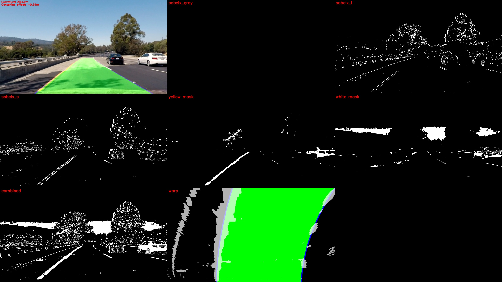
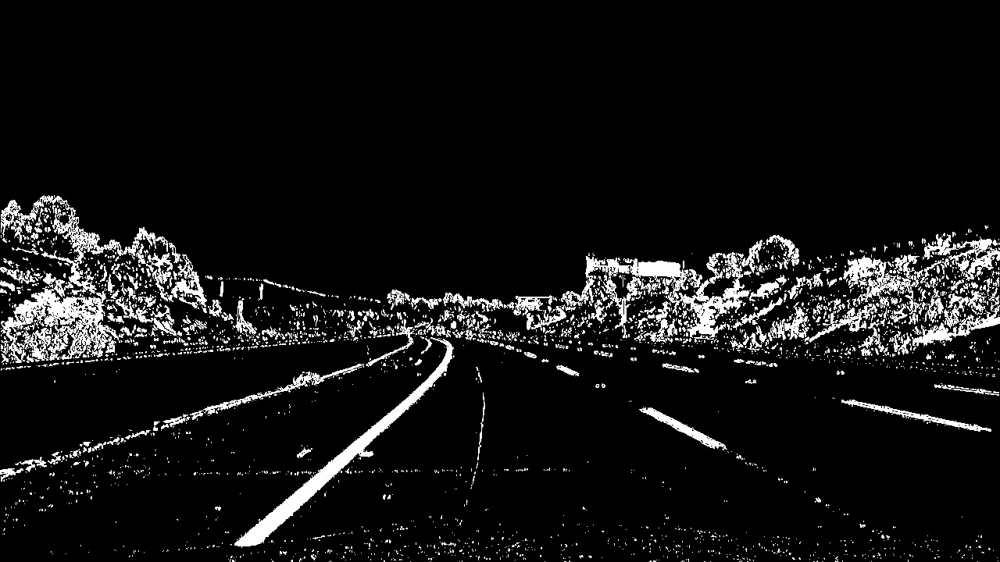

#Advanced Lane Finding Project#
[](http://www.udacity.com/drive)

The goals / steps of this project are the following:

* Compute the camera calibration matrix and distortion coefficients given a set of chessboard images.
* Apply a distortion correction to raw images.
* Use color transforms, gradients, etc., to create a thresholded binary image.
* Apply a perspective transform to rectify binary image ("birds-eye view").
* Detect lane pixels and fit to find the lane boundary.
* Determine the curvature of the lane and vehicle position with respect to center.
* Warp the detected lane boundaries back onto the original image.
* Output visual display of the lane boundaries and numerical estimation of lane curvature and vehicle position.

### Camera Calibration

#### 1. Briefly state how you computed the camera matrix and distortion coefficients. Provide an example of a distortion corrected calibration image.

The code for this step is contained in `calibration.py`

```python
# Checkerboard dimensions
nx = 9
ny = 6

# Prepare object points like [0,0,1], [1,0,0] etc.
objp = np.zeros((nx*ny, 3), np.float32)
objp[:, :2] = np.mgrid[0:nx, 0:ny].T.reshape(-1, 2)
```

I start by preparing the object points which will be the (x, y, z) coordinates of the chessboard corners in the real world. I assume that the chessboard is fixed at z=0, such that the object points are the same for each image.

The function `cv2.findChessboardCorners()` is used to find the chessboard corners. If a chessboard is successfully found on the image then the image points are appended to a list

```python
if ret:
    # Append to objectpoints and imgpoints
    objpoints.append(objp)
    imgpoints.append(corners)
```

`objpoints` and `imgpoints` are used to calculate the camera undistortion matrix

```python
ret, mtx, dist, rvecs, tvecs = cv2.calibrateCamera(objpoints, imgpoints, img_size, None, None)
```

### Pipeline (single images)

#### 1. Provide an example of a distortion-corrected image.

The lane line finding pipeline is contained in `lanefinder.py`, starting with the function `lanefinder_pipeline()` on line 86

Executing `cv2.undistort()` on the calibration images yields the following example:


#### 2. Describe how (and identify where in your code) you used color transforms, gradients or other methods to create a thresholded binary image.  Provide an example of a binary image result.


I used a combination of color and gradient thresholds to generate a binary image:



- Sobel filter on grayscale
- Sobel filter on L-channel
- Sobel filter on S-channel
- Yellow line mask
- White line mask

These are combined using a binary OR operation to get the combined image



#### 3. Describe how (and identify where in your code) you performed a perspective transform and provide an example of a transformed image.

The perspective warp was done by manually finding points in the image using the `cv2.imshow()` plot (this gives you the X and Y coordinates under your cursor)


```python
# manually determined using image plotter
road_plane = np.array([[195, img.shape[0]],
                       [600, 446],
                       [680, 446],
                       [1124, img.shape[0]]], np.float32)

# squeeze factor for squeezing the image in the X direction
# This stops the lane lines curving off the side
# of the warped image which causes clipping of the
# lane visualization
sf = 0.5
dest_plane = np.array([[road_plane[0][0] + sf * (img.shape[1] / 2 - road_plane[0][0]), img.shape[0]],
                       [road_plane[0][0] + sf * (img.shape[1] / 2 - road_plane[0][0]), 0],
                       [road_plane[3][0] + sf * (road_plane[0][0] - img.shape[1] / 2), 0],
                       [road_plane[3][0] + sf * (road_plane[0][0] - img.shape[1] / 2), img.shape[0]]], np.float32)
```

Note that this approach also squeezes the image in the horizontal direction. The purpose of this is to ensure that the lane lines don't curve past the side edge of the transformed image in small radius curves, ensuring a more robust polynomial fit.

Perspective transform without squeeze:


Perspective transform with squeeze:


The ground plane transform is obtained by running `get_ground_plane_transform()` from `lanefinder.py` once at the beginning of the script. This also creates the example image based on `test_images/straight_lines1.jpg`

This function also calculates the X and Y pixels per meter, because these values are affected by the squeeze factor.

#### 4. Describe how (and identify where in your code) you identified lane-line pixels and fit their positions with a polynomial?

Using the perspective-shifted binary image ("warped binary"), I used a histogram to identify the base of the lanelines. Then, for the first frame, I use the sliding windows method to identify the relevant points, and fit a polynomial to the left and right lane line.

The sliding windows function (`sliding_window()`) is found in `lanefinder.py`

I created a class `Line()` (`line.py`) to track lane lines. This class also contains helper functions for various things, like obtaining the polyline and various other useful things.

Subsequent frames are found using the search from prior approach.

The `search_from_prior()` function is actually implemented within the `Line()` class

Some sanity checks include:
- Using an EWMA filter to smooth the laneline between frames
- Checking how much the A coefficient of the polynomial changes between frames

If these sanity checks fail, the new laneline is discarded and the previous lane line is used.

If more than 5 lines are discarded in a row, the algorithm reverts to the sliding windows approach to reset itself, and continues with search from prior, following this rule.


#### 5. Describe how (and identify where in your code) you calculated the radius of curvature of the lane and the position of the vehicle with respect to center.

This is implemented in `Line()` (`line.py`) with two functions: `get_curvature_pixels()` which gets the curvature in pixels, and `get_curvature_meters()`, which returns the curvature in meters based on the x and y pixels per meter values given by `get_ground_plane_transform()` in `lanefinder.py`

#### 6. Provide an example image of your result plotted back down onto the road such that the lane area is identified clearly.


---

### Pipeline (video)

#### 1. Provide a link to your final video output.  Your pipeline should perform reasonably well on the entire project video (wobbly lines are ok but no catastrophic failures that would cause the car to drive off the road!).

Here's a [link to my video result](./project_video_output.mp4)

Here's a [link to my debug video](./project_video_output_debug.mp4), which I used to tune the parameters of the image transforms.

---

### Discussion

#### 1. Briefly discuss any problems / issues you faced in your implementation of this project.  Where will your pipeline likely fail?  What could you do to make it more robust?

The approach I took used mainly the new techniques which I learned in the computer vision lessons. I did not re-use the Hough lines principles, because I thought this was not ultimately the point of the advanced lane finding algorithm. In retrospect, I should have used the new techniques in combination with the previous Hough examples to increase the robustness of my detection.

One problem with the detection algorithm is that it is quite sensitive to changes in road surface condition and does some weird things when shadows are present.

Generally, it works, but it could be refined by spending more time on finding appropriate values for the filtering thresholds. The trial-and-error approach which I took is a naive one. Further work could include finding a way of determining the confidence of a line detection, a more scientific approach to finding the ideal parameters of the transforms, or even a machine learning-based approach for these
